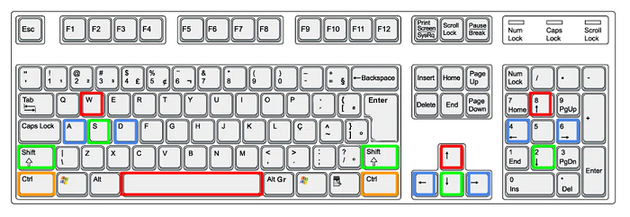
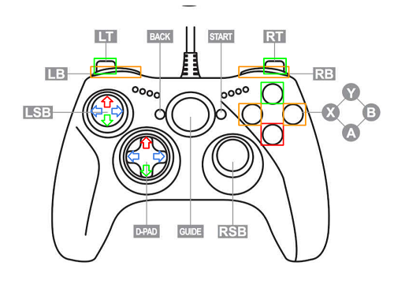

# Wacky Railroad - Game Design Document

## Introdução

Em Wacky Railroad, você controla uma locomotiva em uma ferrovia maluca e imprevisível, cheia de obstáculos exóticos. 
Pule entre trilhos, faça manobras e destrua tudo em seu caminho.
Chegue na estação sem derrubar sua carga.

## Gênero

- Arcade Racing
- Action Racing
- Physics-Based Platformer
- Runner
- Obstacle Course

## Mecânicas

### Movimentação:

- A locomotiva (jogador) avança sozinha, para frente
- A locomotiva pode pular
    - O jogador pode deslocar a locomotiva em três trilhos:
        - Esquerda
        - Meio
        - Direita
    - A locomotiva precisa pular para mudar de trilho
    - Enquanto estiver no ar, o jogador seleciona as teclas de direção para fazer a colomotiva mudar de posição
- A locomotiva pode deslizar (drifting)
    - Enquanto faz o drifting, o jogador pode selecionar as teclas de direção para mudar a inclinação do drift
- A locomotiva pode cair mais rápido
    - Enquanto está no ar, selecionar tecla
- Locomotiva pode usar 'nitro'
    - Se usado durante pulo, a locomotiva se mantém no ar por mais tempo
    - Pode ser usado com o drift

### Controles:

|                  | **Teclado**  | **Controle** |
| :--------------- |:-----------: | -----------: |
|**Pulo**             | Espaço \ W  \ Seta Cima | Analógico (para cima) \ D-PAD (para cima) |
|**Esquerda / Direita** |  A / D \ Seta Esquerda / Seta Direita | Analógico (esquerda-direita) \ D-PAD (esquerda-direita) |
|**Drift / Cair**       | S \ Seta Baixo \ Shift Esquerdo \ Shift Direito | Analógico (para baixo) \ D-PAD (para baixo) \ Y \ L2 \ R2 |
|**Nitro**            | Control Esquerdo \ Control Direito | L1 \ R1 \ X |

#### Layouts:

### Recursos e HUD:

1. Barra de Nitro
    - Permite uso do nitro
    - 1 barra (unidade, esvazia por completo ao ser usada)
    - Recupera com o tempo
    - Recupera coletando vagões-tanque

2. Barra de Foguete
    - Permite troca de trilho durante pulo
    - 1 barra (unidade, esvazia por completo ao ser usada)
    - Recupera quando a locomotiva encosta no trilho
    - Recupera coletando vagões voadores

3. Barra de Drift
    - Permite drift
    - Limita tempo de uso de drift
    - 1 barra (esvazia conforme o drift é usado)
    - Aumenta quando um obstáculo que precisa de drift para ser destruído é colidido
    - Insistir em fazer drift com a barra vazia, ocasiona um descarrilamento

4. Barra de Carga
    - Começa o nível com 5 barras
    - Perde 1 unidade ao colidir com obstáculos
    - É convertido em carvão no final da fase
    - Pode aumentar ao colidir com vagões de carga durante o nível
    - É atrelada a “vida” do jogador, se acabar é Game Over

5. Carvão
    - Moeda do jogo
    - Ícone e número que representam a quantia adquirida
    - Permite compra fora das fases, na rotunda (loja)
    - Carvão extra pode ser encontrado durante as fases em vagões de carvão

6. Porcetagem de chegada
    - Mede quanto falta para chegar no fim da fase
    - Medido em porcentagem
    - Barra que aumenta progressivamente e texto no meio

### Trilhos

- 3 trilhos
- Movimentação restrita dentro dos 3 trilhos
- O nível começa com 1 trilho para aprendizagem do jogador
- Eventualmente, os outros 2 trilhos são inseridos no nível
- Alguns trilhos durante o nível podem acabar (fim de linha)
    - Necessário mudar de trilho 
- Existem obstáculos que surgem nos trilhos para atrapalhar o jogador
- Existem seções de curvas nos níveis
    - Nessas seções os obstáculos leves aparecem
    - O drift é usado aqui

### Obstáculos

#### Alguns obstáculos removem 1 carga do jogador se forem colididos:

1. Baixos
    - Precisa pular para desviar

2. Altos
    - Só podem ser colididos se a locomotiva pular
    - O jogador precisa cair rápido ou mudar de trilho no ar para desviar

3. Leves
    - Precisam de drift para serem destruídos
    - Encontrados em curvas

#### Alguns obstáculos causam o descarrilamento da locomotiva:

4. Vulneráveis/Barreiras
    - Precisam de nitro para serem destruídos
    - Bloqueiam alguma passagem importante no nível
    - Não pode ser desviado de nenhuma outra forma

5. Paredes
    - Impede passagem no trilho
    - Precisa mudar de trilho para evitar colisão

6. Trilhos sem saída
    - Precisa mudar de trilho

7. Imã
    - Funciona como um Boss do jogo
    - O imã é um braço mecânico que segue o jogador
    - O jogador não pode ficar muito tempo embaixo do imã

### Descarrilamento

- Ocorre quando:
    - Locomotiva sai dos trilhos
    - Colisão com alguns obstáculos
    - Drift usado quando a barra de drift estiver vazia
- O descarrilamento remove 1 carga do jogador
- Se o jogador ainda tiver carga após o descarrilamento, ele é direcionado para o último Checkpoint salvo
- Se a carga estiver vazia quando o descarrilamento acontece, resulta em Game Over

### Checkpoint

- O jogador é direcionado para o Checkpoint após um descarrilamento, se ele ainda tiver carga disponível
- Os Checkpoints são estruturas encontradas em partes chave dos níveis
- Um Checkpoint é salvo após a locomotiva passar pela estrutura

### Game Over

- O jogador perde se a carga acabar
- A locomotiva explode
- Ao perder, o jogador recebe as moedas (carvão) que coletou ao longo do nível

### Rotunda

- Encontrada antes de iniciar o nível
- É a loja do jogo
- Usa o carvão como moeda
- Upgrades:
    - Melhora os status das locomotivas
    - Barra de nitro
    - Barra de foguete
    - Barra de drift
    - Capacidade de carga
- Locomotivas:
    - As outras locomotivas possuem status melhores em algum(ns) dos recursos;
    - Todas as locomotivas podem ter upgrade, com o mesmo limite;

#### Tabelas de preços:

##### Locomotivas:
| | Nitro | Foguete | Drifting | Carga | **Preço**
| :--- | :---: | :---: | :---: | :---: | ---: |
| **Padrão** | 1 | 1 | 3 | 5 | **0** |
| **Apressado** | 3 | 1 | 2 | 4 | **100** |
| **Manobrista** | 1 | 3 | 3 | 2 | **175** | 
| **Drifter** | 1 | 1 | 5 | 3 | **225** |
| **Ambicioso** | 1 | 1 | 1 | 7 | **300** |

##### Upgrades:

| | Melhoria | Limite | Aumento de custo | **Preço** |
| :--- | :---: | :---: | :---: | ---: |
| **Nitro** | +1 | 3 | +50% | **25** |
| **Foguete** | +1 | 3 | +50% | **75** |
| **Drifting** | +10% | 3 | +50% | **25** |
| **Carga** | +1 | 3 | +50% | **50** |

### Estilo artístico
- 3D
- Voxels
- Colorido
- Ambiente rural
- Fazenda
